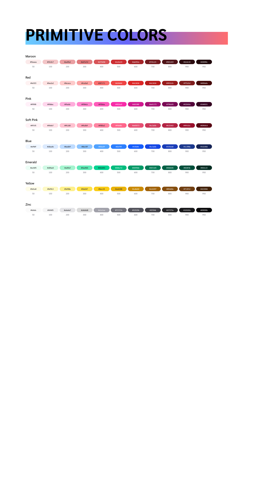
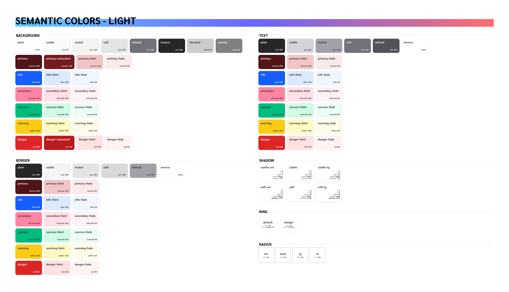
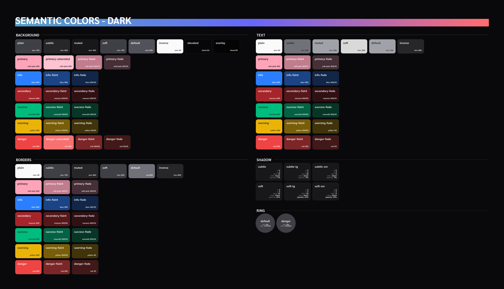
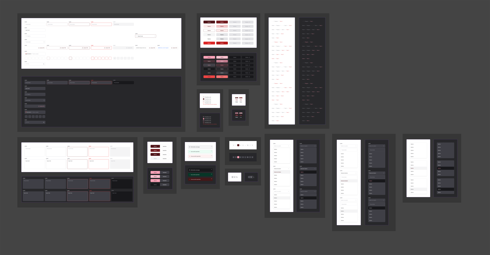
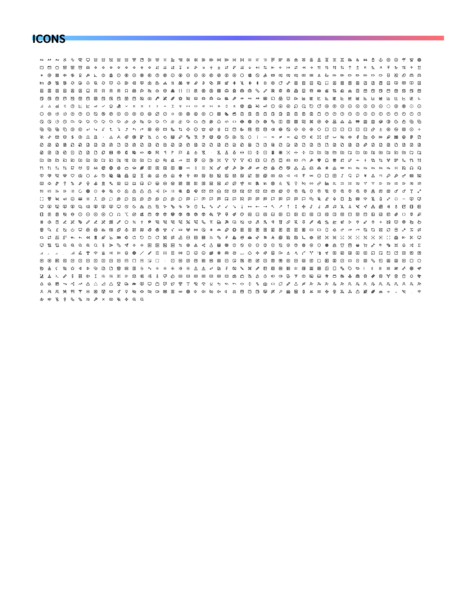
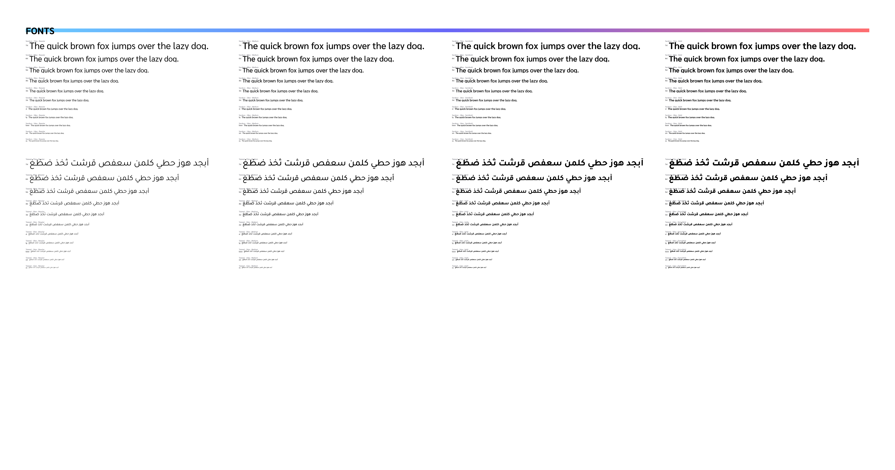

# أمثلة توضيحية

## Reference Examples

> **مهم:** الصور التالية موجودة فقط لتوضيح **الفكرة وطريقة تنظيم الـDesign System**.
>
> هي ليست تصميمًا مطلوبًا نسخه، وليست ألوانًا أو Fonts أو Components مفروضة على Lora.
>
> المطلوب هو فهم **طريقة التفكير والتنظيم**، ثم بناء النظام الخاص بـLora بما يتناسب مع الـBrand والـUser Experience.

---

# 01. مثال على Primitive Colors

## Primitive Colors

في المثال التالي نوضح فكرة **Primitive Colors**.

الـPrimitive Colors هي مجموعة الألوان الأساسية التي يمكن بناء نظام الألوان فوقها.

### المطلوب فهمه من المثال

الفكرة هنا إن الألوان الأساسية تكون منظمة بطريقة واضحة، مثل:

```text
Primary
Secondary
Neutral
Success
Warning
Error
Info
```

وممكن يكون لكل Color درجات مختلفة حسب احتياج النظام.

### مثال توضيحي



> **ملاحظة:** القيم والألوان الموجودة في الصورة هي مثال للتوضيح فقط، وليست مطلوبة كما هي في Lora.

---

# 02. مثال على Semantic Colors

## Semantic Colors

بعد تحديد الـPrimitive Colors، نستخدم **Semantic Colors** لربط الألوان بوظيفتها داخل النظام.

الفكرة ببساطة:

بدل ما الـComponent يقول:

```text
استخدم Gray 900
```

نقول:

```text
استخدم Text Primary
```

وبدل:

```text
استخدم White
```

نقول:

```text
استخدم Background
```

### الفكرة الأساسية

نريد أن يكون الـColor مرتبطًا **بوظيفته** وليس فقط بقيمته.

مثال:

```text
Text Primary
Text Secondary

Background
Background Surface

Border

Primary
Secondary

Success
Warning
Error
Info
```

وده هيساعدنا في:

- Consistency.
- Light / Dark Theme.
- إعادة استخدام الألوان.
- سهولة الـDeveloper Handoff.

### مثال توضيحي



> **ملاحظة:** المثال يوضح فكرة الـSemantic Tokens وطريقة تنظيمها، وليس المطلوب نسخ الألوان أو الـNaming كما هي.

---

# 03. مثال على Semantic Colors في Dark Theme

## Semantic Colors — Dark Theme

نفس الـSemantic Tokens يمكن أن يكون لها Values مختلفة في الـDark Theme.

### الفكرة المهمة

إحنا لا نعمل نظام ألوان جديد بالكامل للـDark Mode.

نفس الـSemantic Tokens تظل موجودة:

```text
Background
Text Primary
Text Secondary
Border
Primary
Success
Warning
Error
```

لكن القيم المستخدمة خلف هذه الـTokens تتغير حسب الـTheme.

بالتالي:

```text
Light Theme
      ↓
Semantic Tokens
      ↓
Light Values
```

و:

```text
Dark Theme
      ↓
Semantic Tokens
      ↓
Dark Values
```

وده هو السبب اللي بيخلينا نبني الـTheme من البداية بدل ما نضيفه في النهاية.

### مثال توضيحي



> **ملاحظة:** الصورة توضح طريقة تطبيق الـSemantic Tokens في الـDark Theme فقط، وليست Color Palette مطلوبة لـLora.

---

# 04. مثال على Components

## Components

الصورة التالية مثال على طريقة تنظيم الـComponents داخل Design System.

### المطلوب فهمه من المثال

الـComponent مش مجرد شكل واحد.

ممكن يكون له:

```text
Component
├── Variants
├── Sizes
├── States
└── Properties
```

مثال:

```text
Button

Variants:
- Primary
- Secondary
- Outline
- Ghost

States:
- Default
- Hover
- Focus
- Disabled
- Loading
```

ومش لازم نستخدم نفس الـVariants الموجودة في الصورة.

المهم نفهم:

> **إزاي ننظم الـComponent كجزء من System، بحيث يكون واضح وقابل لإعادة الاستخدام.**

### مثال توضيحي



> **ملاحظة:** المثال يوضح طريقة تنظيم الـComponents وخصائصها، وليس المطلوب نسخ الـComponents أو الـVariants الموجودة فيه.

---

# 05. مثال على Icons

## Icons

الصورة التالية مثال على تنظيم الـIcons داخل Design System.

### المطلوب تحديده

محتاجين نحدد داخل Lora:

- نوع الـIcon Style.
- الـStroke.
- أحجام الـIcons.
- طريقة الـAlignment.
- طريقة استخدام الـIcons داخل الـComponents.

ومهم جدًا مراعاة:

**LTR + RTL**

خصوصًا مع الـDirectional Icons.

### مثال توضيحي



> **ملاحظة:** الـIcons الموجودة في الصورة مثال للتوضيح فقط، والاختيار النهائي يجب أن يكون مناسبًا لـLora.

---

# 06. مثال على Typography

## Fonts — Arabic & English

الصورة التالية توضح فكرة تنظيم الـTypography والـFonts المستخدمة داخل الـDesign System.

### المطلوب تحديده

محتاجين نختار **Typography System** مناسب لـLora ويدعم:

```text
English
+
Arabic
```

ويتم تحديد:

- Font Family.
- Font Weights.
- Font Sizes.
- Line Heights.
- Headings.
- Body Text.
- Labels.
- Buttons.

### مهم جدًا

اختيار الـFont لا يكون بناءً على شكله بالإنجليزي فقط.

لازم نشوف:

```text
English
+
Arabic
```

مع بعض، ونتأكد إن الـTypography متناسقة وقابلة للاستخدام في اللغتين.

### مثال توضيحي



> **ملاحظة:** الـFonts الموجودة في الصورة مثال للتوضيح فقط، وليست Fonts مفروضة على Lora.

---

# 07. إزاي نستخدم الأمثلة دي؟

الصور السابقة هدفها توضيح:

## طريقة التفكير

مش:

## النتيجة النهائية المطلوبة

يعني لو الصورة فيها:

```text
Color
→ Primary
→ Secondary
→ Neutral
```

المطلوب مش إننا نستخدم نفس الألوان.

ولو الصورة فيها:

```text
Button
→ Primary
→ Secondary
→ Ghost
```

المطلوب مش إننا ننسخ الشكل أو الـVariants.

لكن نفهم:

> **إزاي الـDesign System بيتنظم، وإزاي عناصره مرتبطة ببعض.**

---

# 08. قاعدة مهمة جدًا

> **Reference ≠ Final Design**

الـReference يساعدنا في:

- فهم الفكرة.
- فهم التنظيم.
- معرفة الـPatterns الشائعة.
- أخذ Inspiration.

لكن الـFinal Design الخاص بـLora يجب أن يتم تحديده بناءً على:

- Lora Brand.
- User Experience.
- Target Audience.
- Design Principles.
- Accessibility.
- Consistency.
- Technical Feasibility.

---

# 09. المطلوب من الفريق

بعد الاطلاع على الأمثلة، المطلوب إننا نبني **Design System خاص بـLora**.

يعني نحدد:

```text
Lora
│
├── Colors
│   ├── Primitive
│   └── Semantic
│
├── Typography
│   ├── Arabic
│   └── English
│
├── Icons
│
├── Components
│   ├── Variants
│   ├── States
│   └── Properties
│
└── Themes
    ├── Light
    └── Dark
```

مع دعم:

```text
English → LTR

Arabic → RTL
```

---

# 10. الخلاصة

الأمثلة الموجودة هنا ليست **Template** لازم ننسخه.

هي فقط بتوضح لنا:

> **إيه شكل الـDesign System لما يكون منظم؟**

وإحنا هنأخذ **الفكرة والمنهج** ونبني نظام Lora الخاص بنا، بما يتناسب مع الـBrand والـUsers والـExperience المطلوبة.
